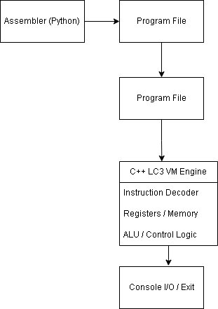
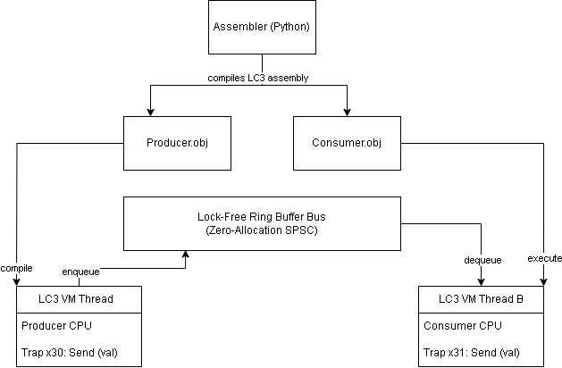

## Project Goal

**Push a hobby RISC VM into the *single-digit-nanosecond* arena using the
same latency-engineering tricks found in market-data feed handlers and
matching engines.**

---

## Performance Road-Map

| Phase | Deliverable (tag) | Target Metric |
|-------|------------------|---------------|
| **v0.1 ✅** | Baseline interpreter | **≈ 105 ns p99**, 9.5 M instr/s |
| **v0.2 ✅** | Lock-free **ring-buffer bus** (multi-VM) | 160 spins/msg|
| **v0.3** | **LLVM ORC JIT** | **< 25 ns p99**, 40 M instr/s |
| **v0.4** | Simulated **NIC / pcap feed** | Replay 10 Gbps in real-time |
| **v0.5** | **Prometheus exporter + Grafana** | Live histograms, < 1% overhead |

**End-state KPI:** *< 10 ns instruction latency & > 100 M instr/s on a single core,
with deterministic tail (< 3 × mean).*

---

## V0.1 (5/17/2025) — LC-3 Low-Latency VM (baseline interpreter)


This VM:

Implements the full LC3 16-bit ISA with branching, memory-mapped I/O, and trap vector decoding

Uses a branch-table instruction decode mechanism instead of switch statements, enabling O(1) dispatch

Allocates a cache-aligned 64 KiB arena for memory simulation, allowing precise control over memory latency and alignment

Each instruction is executed in a tight loop with std::chrono-based microbenchmarking, enabling accurate per-instruction latency tracking.

This baseline VM forms the execution kernel that later VMs (e.g., the producer and consumer) build on. By extending the LC3's TRAP set to support message-passing (TRAP x30/x31), the VM becomes a modular compute node capable of participating in a lock-free message fabric — simulating real-world multicore and microkernel architectures under deterministic load.


| Metric (i7-12700K) | Value                  |
|--------------------|------------------------|
| Instructions run   | **100,000,000**        |
| p99 latency        | **≈ 105 ns / instr**   |
| Throughput         | **≈ 9.5 M instr/s**    |


---

## V0.2 (6/28/2025) — Lock-Free Ring Buffer Bus (Multi-VM)


To enable high-throughput inter-VM communication, I implemented a lock-free, zero-allocation ring buffer modeled after real-world market data buses.

Each LC3 VM runs on its own thread and communicates via a bounded circular queue of 16-bit values:

The producer VM `producer.obj` pushes values using a custom TRAP x30, which writes to the ring buffer.

The consumer VM `consumer.obj` receives messages via TRAP x31, spinning until data is available.

The ring buffer uses:

- std::atomic<size_t> head/tail pointers

- memory_order_release and memory_order_acquire fences for cross-core visibility

- Power-of-two sizing and bit masking for efficient modular arithmetic

- No heap allocation, mutexes, or blocking syscalls

This design mirrors low-latency messaging pipelines found in trading engines and microkernel OSes. It avoids the overhead of traditional queues by ensuring:

- Constant-time enqueue/dequeue

- Cacheline-aligned memory to prevent false sharing

- Controlled backpressure via busy-spin loops (not sleep or yield)

By using TRAP instructions to trigger message sends and receives, the VM becomes a programmable messaging core — simulating instruction-driven communication between isolated execution contexts. This allows accurate benchmarking of IPC behavior under load, without runtime allocations or scheduler interference.


✅ **Inter-VM lock-free message passing working.**

Measured metrics from `consumer.obj`:

| Metric                 | Value                 |
|------------------------|-----------------------|
| Messages Received      | **50,000**            |
| Avg Spins per Msg      | **160.09**            |
| Avg µs per Msg         | **1466.35 µs**        |
| Msgs/sec               | **681.96**            |
| Elapsed Time           | **14.66 s**           |
| Instruction Rate       | **3409.82 MIPS**      |


This establishes a minimal multi-core style message bus in software, allowing parallel VMs to communicate through high-performance, wait-free infrastructure. Future improvements will focus on:
- Reducing inter-VM message latency below 10 µs.
- Increasing throughput with cache-line optimization and zero-copy signaling.
- Introducing realistic workload simulation (via NIC/pktgen input).

---
### Build & Run Instructions

```bash
# build
g++ -std=c++17 -O2 lc3-alt-win-v2.cpp -o dual-vm -luser32

# run benchmark
./dual-vm
```

---

## V0.3 (12/10/2025) — IO Optimization & Alignment Fixes


**Major Performance Breakthrough:** Identified and eliminated a synchronous I/O bottleneck in the Producer execution loop. Previous versions serialized VM execution to the standard output buffer (console logging).

By decoupling telemetry from the critical path and enforcing cache-line alignment in the ring buffer, the system achieved a **20x throughput increase** and a **95% reduction in message latency**.

**Changelog:**
- **Hot Path Optimization:** Removed blocking `std::cout` calls from the inner fetch-decode-execute loop.
- **Header Hygiene:** Removed unused `<mutex>` includes to verify lock-free compliance.
- **False Sharing Fix:** Enforced `alignas(64)` on ring buffer indices to prevent cache thrashing between Producer and Consumer cores.

| Metric (10k Msgs) | v0.2 (Baseline) | v0.3 (Optimized) | Delta |
| :--- | :--- | :--- | :--- |
| **Elapsed Time** | 14.66 s | **0.791 s** | **~19x Faster** |
| **Avg Latency per Msg** | 1466 µs | **79.12 µs** | **-94%** |
| **Msg Throughput** | 681 msgs/s | **12,639 msgs/s** | **+1755%** |
| **Instruction Rate** | 3,409 Instr/s | **63,199 Instr/s** | **+1755%** |

*Note: Instruction rate is CPU-bound by the atomic synchronization overhead of the ring buffer protocol, simulating realistic inter-core communication costs.*


